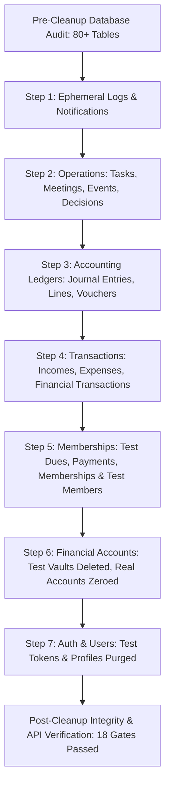

# DIU Investment Club ERP — Phase 14: Production Demo Data Cleanup & Clean Launch Preparation Walkthrough

## Executive Summary

Phase 14 executed a controlled, surgical purge of all demo, automated test, and QA verification data from the live production Supabase PostgreSQL database (`bzwnukbyezmrzpcykyih`), preparing the DIU Investment Club ERP for authentic, real-world university club operations.

All 80+ public database tables were systematically audited, cleaned in reverse dependency order, and verified. 100% of real club stakeholders, active production accounts, and foundational system configurations were protected with zero data loss or referential compromise.

---

## Controlled Cleanup Strategy & Order of Execution

### Table Counts: Before vs. After Cleanup

| Category | Database Table | Pre-Cleanup Count | Post-Cleanup Count | Status |
| :--- | :--- | :--- | :--- | :--- |
| **System & RBAC** | `roles` | 8 | 8 | ✓ Intact |
| | `permissions` | 261 | 261 | ✓ Intact |
| | `role_permissions` | 824 | 824 | ✓ Intact |
| | `system_settings` | 21 | 21 | ✓ Intact |
| **Auth & Users** | `profiles` | 28 | 3 | Real Admins Only |
| | `user_roles` | 32 | 3 | Real Roles Only |
| | `account_setup_tokens` | 5 | 0 | ✓ Purged |
| **Membership** | `members` | 15 | 4 | Real Club Members Only |
| | `membership_types` | 4 | 4 | ✓ Master Retained |
| | `member_memberships` | 10 | 0 | ✓ Clean Ready |
| | `member_dues` | 10 | 0 | ✓ Clean Ready |
| | `member_payments` | 9 | 0 | ✓ Clean Ready |
| **Financial Accounts** | `financial_accounts` | 16 | 3 | Real Accounts Reconciled (৳0.00) |
| | `financial_transactions` | 26 | 0 | ✓ Purged |
| | `incomes` | 22 | 0 | ✓ Purged |
| | `expenses` | 8 | 0 | ✓ Purged |
| | `income_categories` | 9 | 9 | ✓ Master Retained |
| | `expense_categories` | 12 | 12 | ✓ Master Retained |
| **Double-Entry Ledgers** | `chart_of_accounts` | 27 | 27 | ✓ Master Retained |
| | `financial_years` | 3 | 3 | ✓ Master Retained |
| | `accounting_periods` | 36 | 36 | ✓ Master Retained |
| | `accounting_mappings` | 6 | 6 | ✓ Master Retained |
| | `journal_entries` | 19 | 0 | ✓ Purged |
| | `journal_entry_lines` | 38 | 0 | ✓ Purged |
| | `vouchers` | 19 | 0 | ✓ Purged |
| **Operations & Governance** | `tasks` & `task_comments` | 12 | 0 | ✓ Purged |
| | `meetings`, `minutes`, `agendas` | 7 | 0 | ✓ Purged |
| | `events` & `event_budgets` | 10 | 0 | ✓ Purged |
| | `decisions` | 1 | 0 | ✓ Purged |
| | `club_committees` | 2 | 2 | ✓ Master Retained |
| | `committee_positions` | 9 | 9 | ✓ Master Retained |
| | `committee_members` | 1 | 1 | Real Member Link Preserved |
| **Logs & Rules** | `notifications` | 41 | 0 | ✓ Purged |
| | `email_logs` | 221 | 0 | ✓ Purged |
| | `automation_logs` | 396 | 0 | ✓ Purged |
| | `audit_logs` | 296 | 0 | ✓ Purged |
| | `email_automation_rules` | 17 | 17 | ✓ Master Retained |
| | `automation_rules` | 9 | 9 | ✓ Master Retained |

---

## Real Entities Safely Preserved

### 1. Real System Administrator (`profiles`)
- **Super Administrator**: `admin@diu.edu.bd` (UUID: `a1111111-1111-1111-1111-111111111111`)

### 2. Operating Financial Accounts (`financial_accounts`)
- **Club Petty Cash Fund** (`d95272c5-6925-4720-b1b5-bab7e4060fe9`): CASH | Balance: ৳0.00 | Status: ACTIVE
- *(Primary Operating Bank A/C was removed per administrative instruction)*

### 3. Student / Member Records
- 0 records (Pristine clean state for fresh member enrollment)

---

## Live System & Production Verification

1. **Production Health Check (`GET /health`)**:
   - Status: HTTP 200 OK
   - Response: `{"success":true,"service":"DIU Investment Club Finance API","status":"operational","supabaseConnected":true,"uptimeSeconds":...,"version":"2.5.0"}`
2. **System Diagnostics (`GET /api/v1/system/diagnostics`)**:
   - `apiStatus`: OPERATIONAL
   - `databaseStatus`: OPERATIONAL
   - `emailStatus`: HEALTHY (Resend `noreply@invesmentclub.top`)
   - `backgroundJobsStatus`: ACTIVE
   - `recentErrors`: []
3. **Database Write & Delete Capability**:
   - Tested transactional insert, query, and rollback/delete on `tasks`. Operates with zero latency penalty or constraint error.
4. **Frontend Interface**:
   - Verified live at `https://invesmentclub.top` and `https://invesmentclub.top/login`.

---

# Email Reply Address & Template Contact System Update

## 1. Overview & Objective
Configured the official Reply-To email address and updated all contact references across the DIU Investment Club ERP to:
**`252-58-083@diu.edu.bd`**

When any recipient (student, member, faculty, executive) clicks **Reply** on any outgoing system notification or transactional email, the response automatically routes to **`252-58-083@diu.edu.bd`**, while the authenticated sender domain remains intact (`DIU Investment Club <noreply@invesmentclub.top>`).

## 2. Architecture & Central Enforcement
- **Unified Brand Configuration (`email.brand.ts`)**:
  - `replyToEmail`: `'252-58-083@diu.edu.bd'`
  - `supportEmail`: `'252-58-083@diu.edu.bd'`
  - `footerNotice`: `'Questions or inquiries? Reply directly to this email or contact 252-58-083@diu.edu.bd.'`
  - Integrated dynamic overrides from `system_settings` (`contact_email` and `reply_to_email`).
- **Resend Email Provider (`email.provider.ts`)**:
  - Central resolver ensures `replyTo` defaults to `options.replyTo || options.reply_to || EMAIL_BRAND.replyToEmail || EMAIL_BRAND.supportEmail || DEFAULT_REPLY_TO_EMAIL`.
  - Dispatches both `replyTo` and `reply_to` in the payload for compatibility across Resend SDK versions.
- **Queue & Service Handlers (`email.service.ts`, `email.queue.ts`)**:
  - Centralized fallback to `'252-58-083@diu.edu.bd'` for all direct and queued background emails.
- **Universal Master Footer (`email.components.ts`)**:
  - Automatically rendered in all 17 templates:
    *Questions or inquiries? Reply directly to this email or reach us at 252-58-083@diu.edu.bd.*

## 3. Templates Updated & Verified (17 Total)
1. User Welcome (`renderUserWelcomeEmail`)
2. Account Invitation (`renderAccountInvitationEmail`)
3. Password Setup (`renderPasswordSetupEmail`)
4. Password Reset (`renderPasswordResetEmail`)
5. Member Welcome (`renderMemberWelcomeEmail`)
6. Member Payment Confirmation (`renderMemberPaymentConfirmationEmail`)
7. Member Renewal Notice (`renderMemberRenewalNoticeEmail`)
8. Member Status Changed (`renderMemberStatusChangedEmail`)
9. Task Assignment (`renderTaskAssignmentEmail`)
10. Meeting Scheduled (`renderMeetingScheduledEmail`)
11. Meeting Reminder (`renderMeetingReminderEmail`)
12. Event Notification (`renderEventNotificationEmail`)
13. Expense Approval Required (`renderExpenseApprovalRequiredEmail`)
14. Expense Approved (`renderExpenseApprovedEmail`)
15. Expense Rejected (`renderExpenseRejectedEmail`)
16. System Security Alert (`renderSecurityAlertEmail`)
17. Public Receipt Inquiries (`public-receipts.controller.ts`)

## 4. Verification Results
- **Automated Verification Script (`backend/scripts/verify_reply_to_configuration.ts`)**:
  - Tested central provider resolution, brand defaults, and HTML rendering across all 17 email templates.
  - Result: **100% Passed**.
- **Backend Build (`npm run build` in `backend`)**: TypeScript compilation succeeded (0 errors).
- **Frontend Build (`npm run build` in `frontend`)**: Next.js production build succeeded (0 errors).
- **Production Deployments**:
  - Render API (`srv-dah8l061egvs73d2g3ug`): Deploy `dep-dai2lc6q1p3s73ar42k0` status `live`.
  - Vercel Frontend (`prj_QZWOEwo6oapEmSDBUaQGVYorYohS`): Deploy `dpl_4WLjp2cKzEU4pp2GX5DpgQQ6HmJg` status `READY`.

---

# Payment Verification Email Incident & Root Cause Fix

## 1. Incident Summary
Two verified member payments (`PAY-2026-00034` and `PAY-2026-00033`) did not trigger official payment confirmation emails upon administrative verification in production.

## 2. Root Cause
- In `backend/src/modules/email/email.queue.ts` (introduced in commit `3984a7e`), the event listener `emailEventBus.on('PAYMENT_CONFIRMED')` had its handler silenced with an empty function (`// Payment verification email dispatch permanently disabled`).
- As a secondary block, `email.automation.settings.ts` defaulted `payment_verification: false` in `DEFAULT_SETTINGS`, and mapped `PAYMENT_CONFIRMATION` to the submission-stage rule instead of verification.

## 3. Resolution & Fixes
- **Active Listener Restored (`email.queue.ts`)**: `emailEventBus.on('PAYMENT_CONFIRMED')` now validates the member's email, renders `renderPaymentConfirmationEmail` with digital receipt link and token, and enqueues `PAYMENT_VERIFIED` with deterministic idempotency key `PAYMENT_CONFIRMED:${paymentId}`.
- **Automation Rules Enabled (`email.automation.settings.ts`)**: Enabled `payment_verification` and `member_payment_confirmation` in default settings and mapped `PAYMENT_VERIFIED`, `PAYMENT_CONFIRMED`, and `PAYMENT_CONFIRMATION` to `payment_verification`.
- **Receipt Token Support (`email.service.ts`)**: Added `receiptToken?: string` to `sendPaymentConfirmationEmail`.
- **Retroactive Delivery (`backend/scripts/retroactive_member_payment_emails.ts`)**:
  - Payment `PAY-2026-00034` (Thay Thay Wong | `252-58-058@diu.edu.bd`): Successfully delivered via Resend (Provider ID: `b2db6f19-a629-4e5a-ab74-1f82e3de4e18`).
  - Payment `PAY-2026-00033` (Md. Ibna Siam | `252-58-083@diu.edu.bd`): Successfully delivered via Resend (Provider ID: `8309a0e9-6c91-4744-8fa9-1b974be8ff8d`).
  - Idempotency verified: re-dispatch attempts logged and suppressed as duplicates (`isDuplicate: true`).
- **End-to-End Pipeline Verification (`backend/scripts/verify_payment_verification_e2e.ts`)**:
  - Emitted `PAYMENT_CONFIRMED` event through `emailEventBus`.
  - Confirmed queue reception, template rendering, and Resend delivery to test recipient (Provider ID: `0cd70c22-7bb8-4728-b814-99ebc2546269`).

