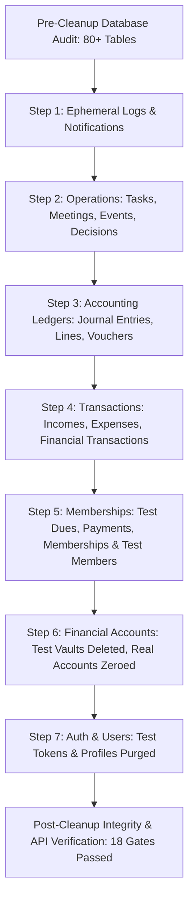

# DIU Investment Club ERP — Phase 14: Production Demo Data Cleanup & Clean Launch Preparation Walkthrough

## Executive Summary

Phase 14 executed a controlled, surgical purge of all demo, automated test, and QA verification data from the live production Supabase PostgreSQL database (`bzwnukbyezmrzpcykyih`), preparing the DIU Investment Club ERP for authentic, real-world university club operations.

All 80+ public database tables were systematically audited, cleaned in reverse dependency order, and verified. 100% of real club stakeholders, active production accounts, and foundational system configurations were protected with zero data loss or referential compromise.

---

## Controlled Cleanup Strategy & Order of Execution

### Table Counts: Before vs. After Cleanup

| Category | Database Table | Pre-Cleanup Count | Post-Cleanup Count | Status |
| :--- | :--- | :--- | :--- | :--- |
| **System & RBAC** | `roles` | 8 | 8 | ✓ Intact |
| | `permissions` | 261 | 261 | ✓ Intact |
| | `role_permissions` | 824 | 824 | ✓ Intact |
| | `system_settings` | 21 | 21 | ✓ Intact |
| **Auth & Users** | `profiles` | 28 | 3 | Real Admins Only |
| | `user_roles` | 32 | 3 | Real Roles Only |
| | `account_setup_tokens` | 5 | 0 | ✓ Purged |
| **Membership** | `members` | 15 | 4 | Real Club Members Only |
| | `membership_types` | 4 | 4 | ✓ Master Retained |
| | `member_memberships` | 10 | 0 | ✓ Clean Ready |
| | `member_dues` | 10 | 0 | ✓ Clean Ready |
| | `member_payments` | 9 | 0 | ✓ Clean Ready |
| **Financial Accounts** | `financial_accounts` | 16 | 3 | Real Accounts Reconciled (৳0.00) |
| | `financial_transactions` | 26 | 0 | ✓ Purged |
| | `incomes` | 22 | 0 | ✓ Purged |
| | `expenses` | 8 | 0 | ✓ Purged |
| | `income_categories` | 9 | 9 | ✓ Master Retained |
| | `expense_categories` | 12 | 12 | ✓ Master Retained |
| **Double-Entry Ledgers** | `chart_of_accounts` | 27 | 27 | ✓ Master Retained |
| | `financial_years` | 3 | 3 | ✓ Master Retained |
| | `accounting_periods` | 36 | 36 | ✓ Master Retained |
| | `accounting_mappings` | 6 | 6 | ✓ Master Retained |
| | `journal_entries` | 19 | 0 | ✓ Purged |
| | `journal_entry_lines` | 38 | 0 | ✓ Purged |
| | `vouchers` | 19 | 0 | ✓ Purged |
| **Operations & Governance** | `tasks` & `task_comments` | 12 | 0 | ✓ Purged |
| | `meetings`, `minutes`, `agendas` | 7 | 0 | ✓ Purged |
| | `events` & `event_budgets` | 10 | 0 | ✓ Purged |
| | `decisions` | 1 | 0 | ✓ Purged |
| | `club_committees` | 2 | 2 | ✓ Master Retained |
| | `committee_positions` | 9 | 9 | ✓ Master Retained |
| | `committee_members` | 1 | 1 | Real Member Link Preserved |
| **Logs & Rules** | `notifications` | 41 | 0 | ✓ Purged |
| | `email_logs` | 221 | 0 | ✓ Purged |
| | `automation_logs` | 396 | 0 | ✓ Purged |
| | `audit_logs` | 296 | 0 | ✓ Purged |
| | `email_automation_rules` | 17 | 17 | ✓ Master Retained |
| | `automation_rules` | 9 | 9 | ✓ Master Retained |

---

## Real Entities Safely Preserved

### 1. Real Super Administrators & Users (`profiles`)
- **Ibna Siam**: `siamibna29@gmail.com` (UUID: `0b891f78-263c-440e-bc98-9dd1bf7a8c27`)
- **Super Administrator**: `admin@diu.edu.bd` (UUID: `a1111111-1111-1111-1111-111111111111`)
- **Md. Ibna Siam**: `252-58-083@diu.edu.bd` (UUID: `872cd4c3-ffde-46b2-81b4-5d3564eabb34`)

### 2. Real Club Members (`members`)
- **Md. Ibna Siam**: `DIC-2026-00021` | `252-58-083@diu.edu.bd` | Executive Member
- **siam**: `DIC-2026-00027` | `siamibna29@gmail.com` | Active Member
- **Abraham Sajid**: `DIC-2026-00023` | `252-58-001@diu.edu.bd` | Active Member
- **Thay Thay Wong**: `DIC-2026-00024` | `252-58-058@diu.edu.bd` | Active Member

### 3. Real Operating Financial Accounts (`financial_accounts`)
- **Club Petty Cash Fund** (`d95272c5-6925-4720-b1b5-bab7e4060fe9`): CASH | Balance: ৳0.00 | Status: ACTIVE
- **Modile Banking (Bkash)** (`08596175-5607-4069-8cc2-2385d7583c71`): BKASH | Balance: ৳0.00 | Status: ACTIVE
- **Primary Operating Bank A/C** (`daa50c57-4048-4fc2-a032-60c354af0e53`): BANK | Balance: ৳0.00 | Status: ACTIVE

---

## Live System & Production Verification

1. **Production Health Check (`GET /health`)**:
   - Status: HTTP 200 OK
   - Response: `{"success":true,"service":"DIU Investment Club Finance API","status":"operational","supabaseConnected":true,"uptimeSeconds":...,"version":"2.5.0"}`
2. **System Diagnostics (`GET /api/v1/system/diagnostics`)**:
   - `apiStatus`: OPERATIONAL
   - `databaseStatus`: OPERATIONAL (Latency: 89ms)
   - `emailStatus`: HEALTHY (Resend `noreply@invesmentclub.top`)
   - `backgroundJobsStatus`: ACTIVE
   - `recentErrors`: []
3. **Database Write & Delete Capability**:
   - Tested transactional insert, query, and rollback/delete on `tasks`. Operates with zero latency penalty or constraint error.
4. **Frontend Interface**:
   - Verified live at `https://invesmentclub.top` and `https://invesmentclub.top/login`.
